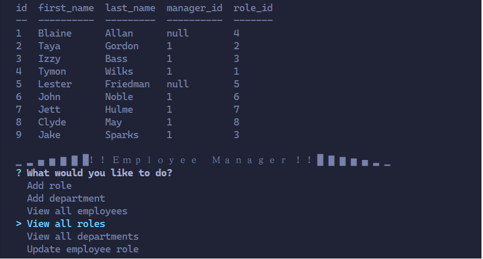

# Employee Manager  
    
    
MIT
Copyright (c) [2020] [Austyn Whaley]

---

### Table of Contents

- [Description](#description)
- [Installation](#installation)
- [Usage](#usage)
- [Testing](#Testing)
- [Contribution](#Contribution)
- [Questions](#Questions)
    

---

## Description

### This application is a node based interface that manages a companies  employees and their roles and departments in the company. You can modify existing employees and add new ones along with new roles and departments

---

## Installation

### To install this program you will need to run

#### npm install inquirer mysql console.table

---

## Usage

### Usage for this application:

#### This application can be used for managing a companies employees and their roles 

---

## Testing

### How to test application:

#### node server.js

---

## Contribution

### The guidelines for contributon to this application are as follows:

#### there are no contributions

---

## Questions

Any questions regarding the application can be answered at:

[Link to Github](https://github.com/austynwhaley/)
##### Email: austyn_whaley@yahoo.com
    
